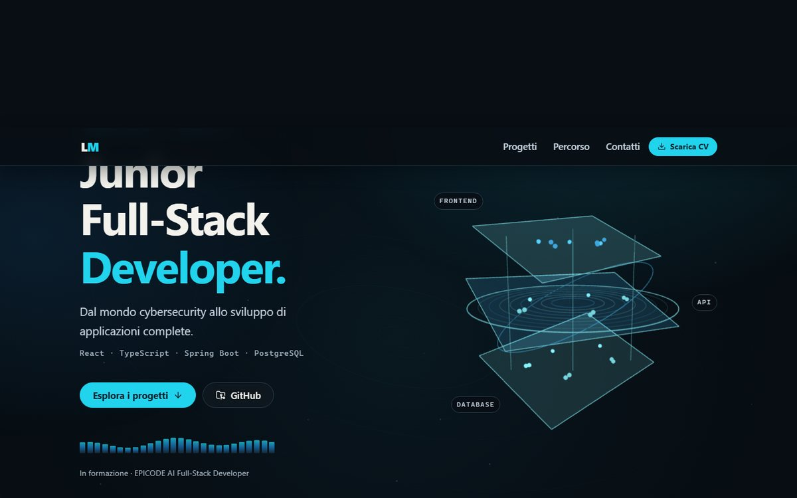
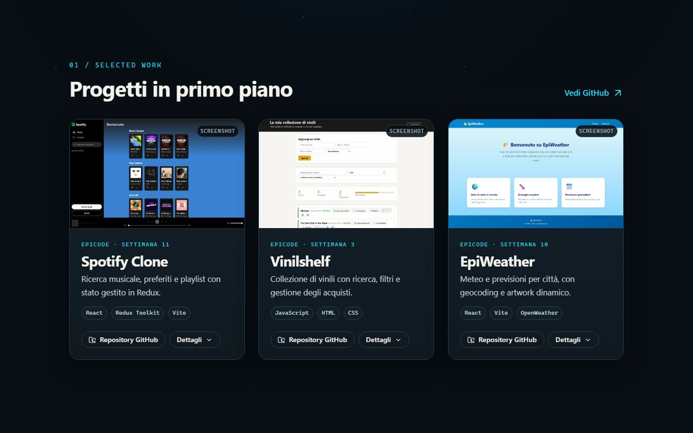
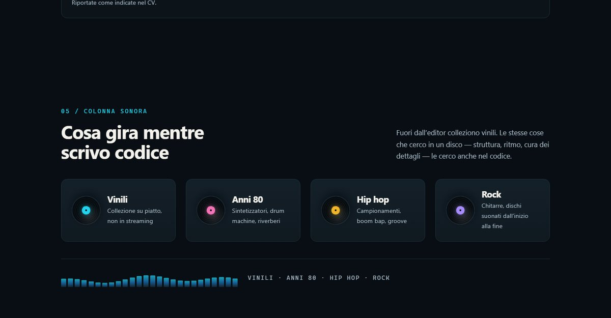

# Lorenzo Melis — Junior Full-Stack Developer

**Dal mondo cybersecurity allo sviluppo di applicazioni complete.**

Laureato in ingegneria informatica, in formazione nel percorso EPICODE
AI Full-Stack Developer. Sviluppo con React, JavaScript, TypeScript, Java,
Spring Boot e PostgreSQL, portando nel codice l'esperienza maturata in
cybersecurity: attenzione alla sicurezza, alla gestione dei dati e alla
collaborazione con team tecnici.

Cerco un ruolo **full stack, frontend o backend**.

📄 [**CV in PDF**](public/cv/lorenzo-melis-cv.pdf) ·
✉️ [lorenzo.melis@yahoo.it](mailto:lorenzo.melis@yahoo.it) ·
💼 [LinkedIn](https://www.linkedin.com/in/lorenzo-melis97/) ·
💻 [GitHub](https://github.com/JusTMeth25)

> Questo repository contiene il codice del mio portfolio personale.
> Una volta pubblicato su GitHub Pages, l'indirizzo del sito va inserito qui.



---

## Progetti in primo piano

Tre progetti del percorso EPICODE. Le immagini nel sito sono **screenshot reali**
delle app, catturati in locale.

### 1. Spotify Clone — settimana 11

Ricerca musicale, preferiti e playlist con stato gestito in Redux.

- **Stack:** React 19, Redux Toolkit, React-Bootstrap, Vite
- Ricerca brani con debounce di 400 ms sull'API Deezer, con stato e risultati in
  Redux
- Player audio: play/pausa, brano precedente e successivo, shuffle, loop, barra
  di avanzamento con seek, controllo del volume
- Preferiti e playlist multiple create dall'utente, con vista dedicata
- Layout mobile-first: sidebar su desktop, barra di navigazione inferiore su
  mobile
- Lo stato vive in memoria: il progetto non usa persistenza
- 📦 [Repository](https://github.com/JusTMeth25/FS0226IT---PROGETTO-SETTIMANA-11)

Progetto didattico: non è un prodotto Spotify e non ha alcuna affiliazione con
Spotify.

### 2. Vinilshelf — settimana 3

Collezione di vinili con ricerca, filtri e gestione degli acquisti.

- **Stack:** JavaScript, HTML5, CSS3, localStorage — nessun framework
- Costruito sul pattern *stato → render() → eventi*
- Inserimento di titolo, artista e anno, con stato "posseduto" o "da acquistare"
- Ricerca live, filtro per stato, ordinamento per anno o titolo, contatori e
  barra di completamento
- Tema chiaro/scuro e persistenza in `localStorage`
- 📦 [Repository](https://github.com/JusTMeth25/FS0226IT---PROGETTO-SETTIMANA-3)

### 3. EpiWeather — settimana 10

Meteo e previsioni per città, con geocoding e artwork dinamico.

- **Stack:** React, React Router, Vite, OpenWeather API, Unsplash, Vitest
- Ricerca città tramite Geocoding API di OpenWeather, con scelta fra omonimi
  prima di aprire la dashboard sulle coordinate esatte
- Dashboard con temperatura, percepita, umidità, vento, pressione e previsioni
- Classi grafiche dinamiche in base alla condizione meteo, artwork della città
  da Unsplash
- Nel repository sono presenti test Vitest e Testing Library
- 📦 [Repository](https://github.com/JusTMeth25/FS0226IT---PROGETTO-SETTIMANA-10)



Altri progetti: [github.com/JusTMeth25](https://github.com/JusTMeth25)

---

## Colonna sonora

Fuori dall'editor colleziono vinili. Il sito ha una sezione dedicata, con quattro
dischi che girano: **vinili**, **anni 80**, **hip hop**, **rock**. Le stesse cose
che cerco in un disco — struttura, ritmo, cura dei dettagli — le cerco anche nel
codice.



---

## Competenze

| Ambito | Tecnologie |
|---|---|
| **Frontend** | HTML5, CSS3, JavaScript, TypeScript, React, Redux Toolkit, Bootstrap, Sass |
| **Backend e dati** | Java, Spring Boot, Spring Web, Spring Data JPA, Spring Security, REST API, SQL, PostgreSQL |
| **Strumenti** | Git, GitHub, Postman, Maven, Vite |
| **Background IT** | Linux, Microsoft Azure, networking, cybersecurity |
| **Lingue** | Italiano (madrelingua), inglese (avanzato), spagnolo (base) |

**Certificazioni:** CompTIA Security+ ce · Linux LPIC-1 ·
Cisco CCNA Routing and Switching · Cisco Cyber Threat Management ·
ITIL v4 Foundation

---

## Percorso

| Periodo | Ruolo | Dove |
|---|---|---|
| Mag 2026 — in corso | AI Full-Stack Developer *(formazione)* | EPICODE |
| Set 2025 — Apr 2026 | Senior Cyber Security Consultant | Protiviti, Roma |
| Mar 2025 — Giu 2025 | Cyber Security Consultant | KPMG Advisory, Roma |
| Mag 2019 — Dic 2024 | Cyber Security Analyst → Specialist → Consultant | Cybertech – Engineering, Roma |
| 2023 — 2026 | Laurea in Ingegneria Informatica L-08 — 105/110 | Universitas Mercatorum |
| 2018 — 2019 | Master in Networks and Information Systems | ELIS College, Roma |


---

## Come è fatto questo sito

Sito statico a pagina unica, senza backend, database, login o chiavi API.

- **React 19 + TypeScript** in modalità `strict`, build con **Vite**
- **Three.js / React Three Fiber** per la scultura animata della hero, con
  solchi concentrici che richiamano un vinile
- **Sequenza d'apertura su canvas 2D**: una fessura di luce diventa un vinile,
  la puntina appoggia sul solco, poi si attraversa il foro del perno
- **Motion for React** per i reveal delle sezioni e la grafica dell'intro
- Animazioni continue e reattive al puntatore: solchi di vinile sullo sfondo,
  equalizzatore che si alza dove passa il cursore, anello che segue il mouse
- Tutto disattivabile: con `prefers-reduced-motion: reduce` l'intro non compare
  e il movimento si ferma
- **CSS con design token**
- Contenuti centralizzati in due file (`src/data/profile.ts` e
  `src/data/projects.ts`)
- Accessibilità: HTML semantico, skip link, navigazione completa da tastiera,
  contrasto oltre la soglia WCAG AA
- Qualità: TypeScript strict, ESLint e test Vitest + Testing Library

### Avvio rapido

```bash
npm install
npm run dev      # http://localhost:5173
```

📖 Comandi completi, personalizzazione, deploy su GitHub Pages e verifiche
eseguite: **[docs/SVILUPPO.md](docs/SVILUPPO.md)**

⚖️ Licenze e provenienza degli asset:
**[THIRD_PARTY_NOTICES.md](THIRD_PARTY_NOTICES.md)**
